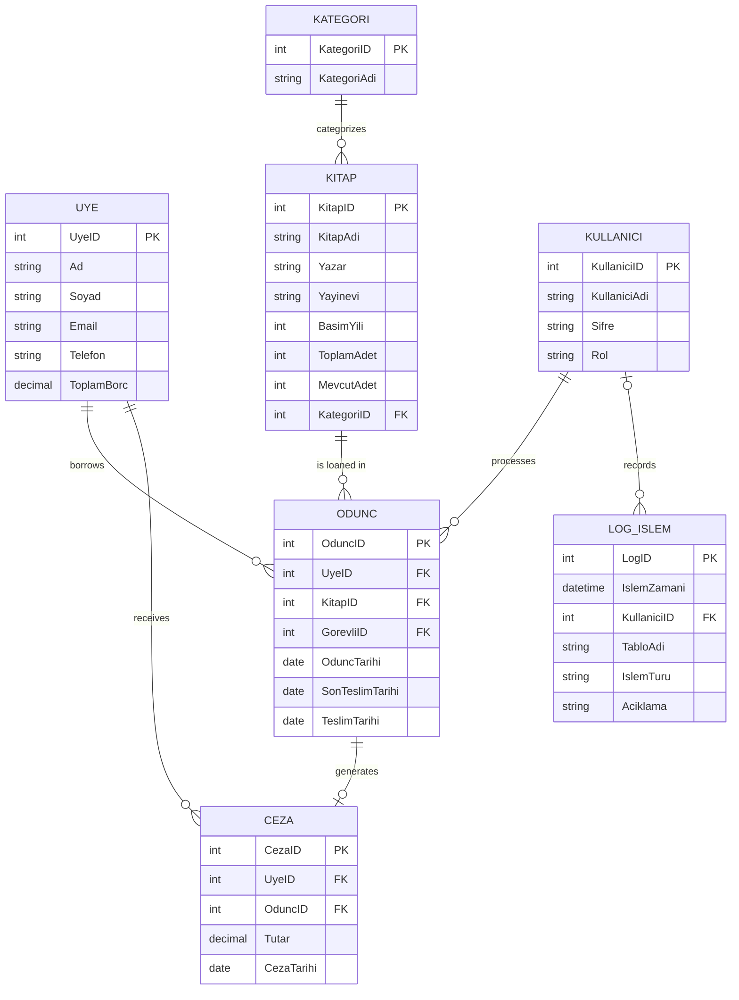

# LIBRAX
LIBRAX is a desktop-based library automation system that manages books, members, and borrowing relationships in a holistic and integrated manner within university libraries.

## ER Diagram (Crow’s Foot)

