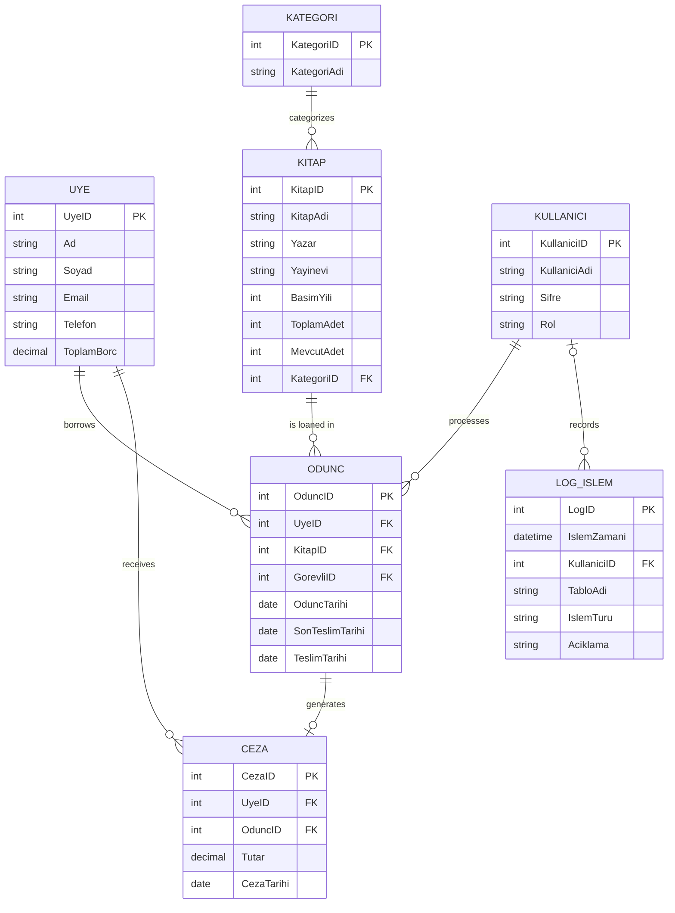

<<<<<<< HEAD
LIBRAX – Library Management System

LIBRAX, PostgreSQL tabanlı bir veritabanı ve Python (PySide6) ile geliştirilmiş,
masaüstü bir Kütüphane Yönetim Sistemidir.
Uygulama; üye yönetimi, kitap yönetimi, ödünç alma–teslim işlemleri, ceza hesaplama
ve dinamik sorgulama özelliklerini içermektedir.

Kullanılan Teknolojiler

Python 3.9+
PostgreSQL 13+
PySide6 (Qt for Python) – GUI
psycopg2-binary – PostgreSQL bağlantısı
python-dotenv – Ortam değişkenleri yönetimi

Veritabanı Kurulumu
PostgreSQL’de boş bir veritabanı oluşturun
CREATE DATABASE librax;

SQL dosyalarını sırayla çalıştırın
PostgreSQL’e bağlandıktan sonra:
\c librax
\i sql/01_schema.sql
\i sql/02_tables.sql
\i sql/03_constraints.sql
\i sql/04_procedures.sql
\i sql/05_triggers.sql
\i sql/06_sample_data.sql

Bu sıralama bozulmamalıdır.

Ortam Değişkenleri (.env)
Proje kök dizininde .env dosyası oluşturun:
DB_HOST=localhost
DB_PORT=5432
DB_USER=postgres
DB_PASSWORD=postgres // Sizin şifreniz 
DB_NAME=librax
DB_SSLMODE=disable

Kendi PostgreSQL kullanıcı bilgilerinize göre düzenleyebilirsiniz.

Python Ortamının Hazırlanması
Sanal ortam oluşturun
python -m venv venv

Sanal ortamı aktif edin
Windows : venv\Scripts\activate

Linux / macOS : source venv/bin/activate

Gerekli paketleri yükleyin
pip install -r requirements.txt

Uygulamanın Çalıştırılması
Proje kök dizinindeyken:
python main.py
=======
# LIBRAX
LIBRAX is a desktop-based library automation system that manages books, members, and borrowing relationships in a holistic and integrated manner within university libraries.

## ER Diagram (Crow’s Foot)

>>>>>>> a9803b4b17279b9a244a0416c10e373e32587925
