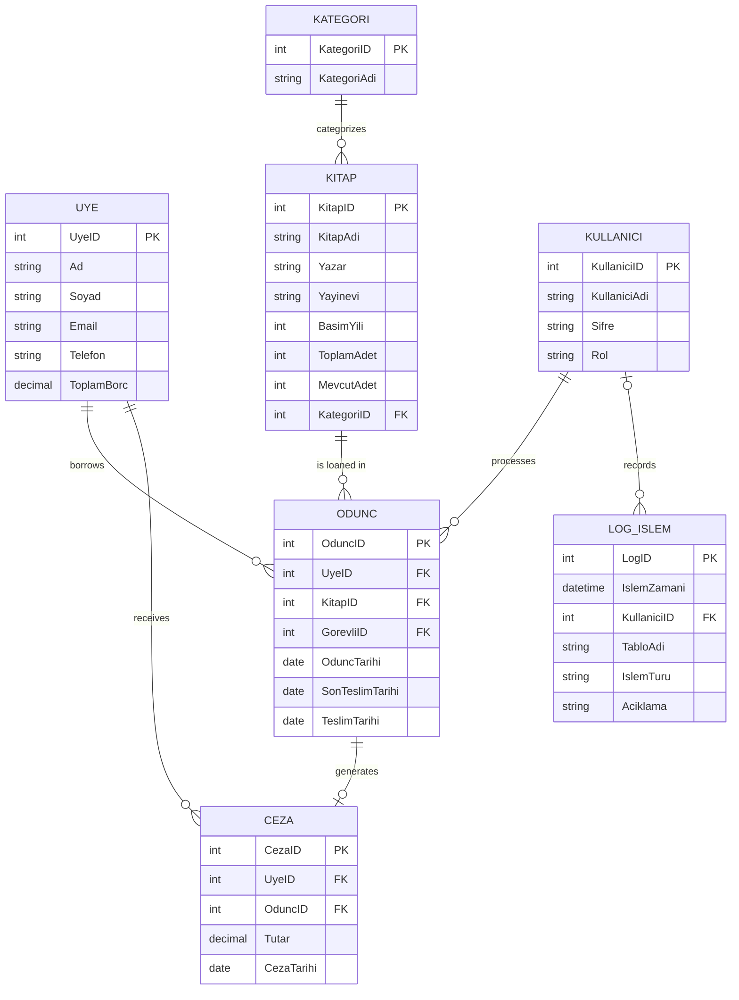

[](https://youtu.be/XJAxeBnO2b8)

# LIBRAX – Library Management System

LIBRAX, PostgreSQL tabanlı bir veritabanı ve Python (PySide6) kullanılarak geliştirilmiş,
masaüstü bir **Kütüphane Yönetim Sistemidir**.  
Üniversite kütüphanelerinde kitap, üye ve ödünç alma süreçlerini bütüncül ve entegre
bir şekilde yönetmeyi amaçlar.

Uygulama aşağıdaki temel işlevleri kapsar:

-  Üye yönetimi  
- Kitap ve kategori yönetimi  
- Ödünç alma – teslim işlemleri  
- Gecikme cezası hesaplama  
- Dinamik ve parametreli sorgulama  
- İşlem kayıtları (loglama)

---


## Kullanılan Teknolojiler

- Python 3.9+
- PostgreSQL 13+
- PySide6 (Qt for Python) – GUI
- psycopg2-binary – PostgreSQL bağlantısı
- python-dotenv – Ortam değişkenleri yönetimi

---

## Veritabanı Tasarımı (ER Diagram – Crow’s Foot)



## 🗄️ Veritabanı Kurulumu

PostgreSQL üzerinde boş bir veritabanı oluşturun:

```sql
CREATE DATABASE librax;

\c librax
\i sql/01_schema.sql
\i sql/02_tables.sql
\i sql/03_constraints.sql
\i sql/04_procedures.sql
\i sql/05_triggers.sql
\i sql/06_sample_data.sql
```

## Ortam Değişkenleri (.env)

```sql
DB_HOST=localhost
DB_PORT=5432
DB_USER=postgres
DB_PASSWORD=postgres
DB_NAME=librax
DB_SSLMODE=disable
```

## Python Ortamının Hazırlanması
```sql
python -m venv venv
# Windows
venv\Scripts\activate
# Linux / macOS
source venv/bin/activate
pip install -r requirements.txt
python main.py
```


